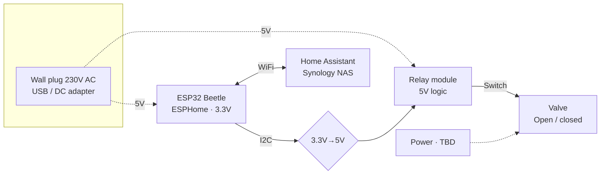

# Desert Quencher

This is a personal project that aims to solve the problem our plants face in the summer when going on vacation for long times. We don't water them for some days, killing some, and hindering growth to others.

## Hardware

The plan is to use a **Beetle ESP32** to control a valve that is connected to the water point in the terrace. Through some tubes with holes, the water will get to the 10+ vases we have around.

The **Beetle ESP32** has both bluetooth and Wi-Fi modules, which makes it possible to communicate with it remotely without too much trouble.

- Beetle ESP32 (SDA and SCL pins)
- 12V valve connected to water point
- Relay module (5V), i2c
- Booster circuit 3V -> 5V
- Wall plug (12V)
- Battery pack (TBD)
- NAS server

## Control

The timings of the watering can either be set as periodically, or we could remotely water them by communicating with Wi-Fi.
The latter is convenient but is not the focus of the project, so it will be done if there's a comfortable time margin.

## Learning opportunities

Besides the practical goal of the project, I want to get familiar with building a project from the ground up with AI. This time I'll be using **CLAUDE** to ideate, design, and code as much as I can. I expect it will save enough time that I can do the extras I normally wouldn't be able to do, such as the Wi-Fi communication layer, a usable UI and more advanced features I think about along the way.
